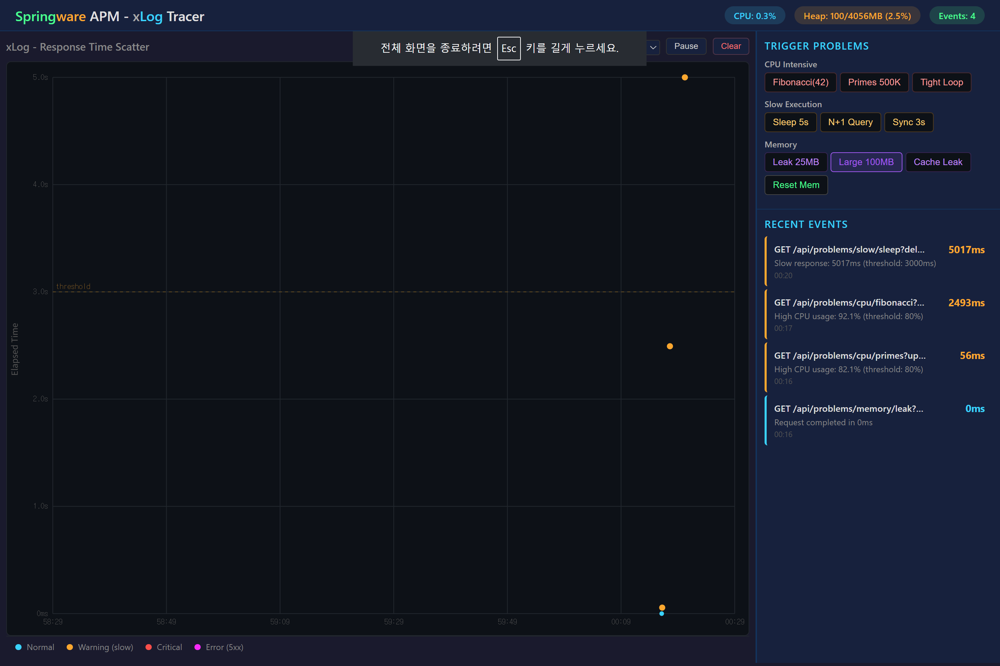
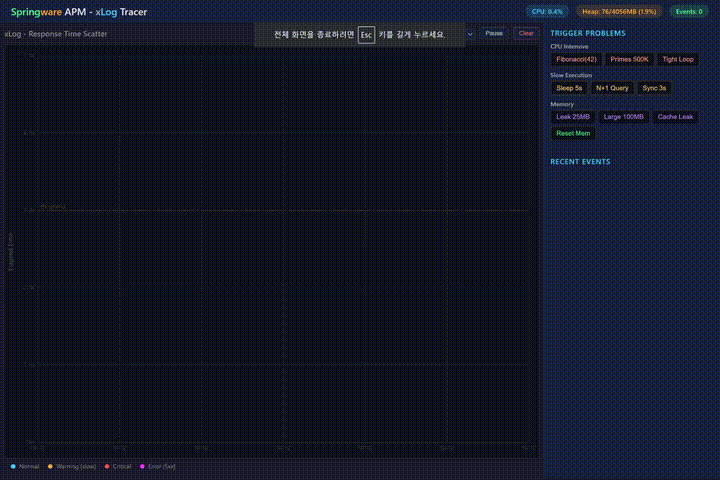

# Springware APM - xLog Tracer

A lightweight Java profiler with a Scouter APM-style **xLog scatter chart** dashboard. Detects CPU, slow execution, and memory issues in real-time via servlet filter profiling, periodic monitoring, and threshold-based alerting.

## xLog Dashboard



### Demo



## Features

- **Per-request profiling** via servlet filter (`ThreadMXBean` CPU time, heap delta, elapsed time)
- **Periodic memory monitoring** with `@Scheduled` system heap checks
- **Threshold-based alerting** with severity escalation (WARNING / CRITICAL)
- **xLog scatter chart** - real-time response time visualization (X=time, Y=elapsed)
- **Color-coded events** - Normal (cyan), Warning (orange), Critical (red), Error (magenta)
- **Trigger buttons** to fire intentional CPU, slow execution, and memory problems
- **Reusable core module** (`kr.springware.profiler.core`) separated from demo app

## Tech Stack

- Spring Boot 3.4.3 / Java 21
- MyBatis 3.0.4 / H2 (in-memory)
- Vanilla HTML/CSS/JS dashboard (no frontend framework)
- Gradle 9.3.1

## Quick Start

```bash
./gradlew bootRun
```

Open [http://localhost:8080](http://localhost:8080) to see the xLog dashboard.

## Problem Endpoints

| Category | Endpoint | Description |
|----------|----------|-------------|
| CPU | `GET /api/problems/cpu/fibonacci?n=42` | Recursive fibonacci (exponential) |
| CPU | `GET /api/problems/cpu/primes?upTo=500000` | Trial division primes |
| CPU | `GET /api/problems/cpu/tight-loop?iterations=100000000` | Math-heavy loop |
| Slow | `GET /api/problems/slow/sleep?delayMs=5000` | Thread.sleep |
| Slow | `GET /api/problems/slow/n-plus-one` | N+1 query pattern |
| Slow | `GET /api/problems/slow/synchronized?workMs=3000` | Lock contention |
| Memory | `GET /api/problems/memory/leak?chunks=50&chunkSizeKb=500` | Static list leak |
| Memory | `GET /api/problems/memory/large-object?sizeMb=100` | Large allocation |
| Memory | `GET /api/problems/memory/cache-leak?key=abc` | Unbounded cache |
| Memory | `POST /api/problems/memory/reset` | Cleanup leaked memory |

## Profiler API

| Endpoint | Description |
|----------|-------------|
| `GET /api/profiler/events` | List all profiler events (filterable by category/severity) |
| `GET /api/profiler/summary` | Aggregated counts by category and severity |
| `GET /api/profiler/status` | Live system health (heap, CPU, event count) |
| `DELETE /api/profiler/events` | Clear event history |

## Test Results

```
> Task :test

ProfilerDemoApplicationTests
  contextLoads()                              PASSED

ProfilerIntegrationTest
  fibonacci_shouldTriggerCpuAlert()           PASSED
  primes_shouldTriggerCpuAlert()              PASSED
  sleep_shouldTriggerSlowExecutionAlert()     PASSED
  nPlusOne_shouldTriggerSlowExecutionAlert()  PASSED
  memoryLeak_shouldTriggerMemoryAlert()       PASSED
  largeAllocation_shouldTriggerMemoryAlert()  PASSED
  dashboard_shouldReturnEvents()              PASSED
  dashboard_shouldReturnStatus()              PASSED

BUILD SUCCESSFUL - 9 tests completed, 0 failed
```

## Package Structure

```
kr.springware.profiler
├── core/                          # Reusable profiler engine
│   ├── config/ProfilerConfig      # @ConfigurationProperties thresholds
│   ├── filter/ProfilingFilter     # Per-request servlet filter
│   ├── detector/ThresholdDetector # Threshold evaluation & severity
│   ├── monitor/                   # CPU & memory monitors
│   ├── store/ProfileEventStore    # Thread-safe event ring buffer
│   ├── model/                     # ProfileEvent, enums
│   └── dashboard/DashboardController  # REST API
└── demo/                          # Demo application
    ├── ProfilerDemoApplication    # @SpringBootApplication
    └── problem/                   # Intentional problem endpoints
        ├── controller/            # CPU, Slow, Memory controllers
        ├── service/               # Problem implementations
        ├── mapper/DemoMapper      # MyBatis mapper
        └── model/DemoItem         # Demo entity
```

## Configuration

```properties
# Thresholds
profiler.threshold.response-time-ms=3000
profiler.threshold.cpu-percent=80
profiler.threshold.memory-percent=85
profiler.threshold.memory-spike-mb=50

# Monitoring
profiler.monitoring-interval-ms=5000
profiler.max-events=1000
```
